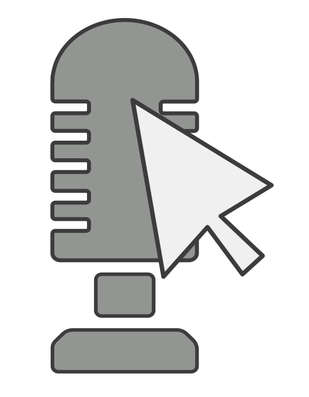

# Vocal Mouse
A program to control your mouse with your vocals.

This is a pretty simple Rust CLI I wrote which listens to your microphone and moves the mouse based off the notes detected.

## How to Run

If you're using nix, then simply run `nix develop` to setup the dev environment. Honestly, just setup nix and do this.

If you don't want to use nix, then install the dependencies for [engio](https://github.com/enigo-rs/enigo) and [cpal](https://github.com/RustAudio/cpal).

Lastly, head to your config directory (~/.config on Linux/MacOS, somewhere else on Windows) and create vocal_mouse/settings.toml. Copy the contents of the [settings template](settings_template.toml) into your file and adjust the settings to fit your setup.

After setting everything up, you can simply run `cargo run` to start the CLI.

If you want to, you could even build the project and move it to your bin directory.

## How to Use

Again, to run the project after settings everything up, use `cargo run`. 

First, setup the settings file, all of the settings are explained in the file, and below.

The power settings relate to how many pixels the mouse will move on each input.

The volume number is arbitrary, not based on decibels or any other standard.

The premise of the program is, the mouse will move a certain direction based off of what pitch your microphone detects. If you cross a certain volume threshold, then the mouse will perform a left or right click, depending on the octave. When between the minimum volume threshold and click volume threshold your volume controls the speed of the mouse.

There are different modes. All selectable in the settings file.

### Mouse Buttons

An input above the click_threshold volume will trigger a mouse button press. 

If the input is from any octave 1-4, then the action will be a left click. Elif the input is from any octave 5-8, then the action will be a right click.

### Standard (std)

Actually useful.

| Note | Mouse Direction |
| ---- | --------------- |
| A/A#/B | right |
| C/C#/D | down |
| D#/E/F | left |
| F#/G/G# | up |

### Advanced (adv)

Like standard mode, but more advanced

| Note | Mouse Direction |
| ---- | --------------- |
| A/A# | right |
| B | right down |
| C/C# | down |
| D | down left |
| D#/E | left |
| F | left up |
| F#/G | up |
| G# | up right |

### Frequency (freq)

I don't know why I made this...

| Frequency | Mouse Direction |
| ---- | --------------- |
| 0-230 | right |
| 230-310 | down |
| 310-400 | left |
| 400-1000 | up |

> [!NOTE]
> If you have issues, which will likely occur on Windows, please open an issue.
